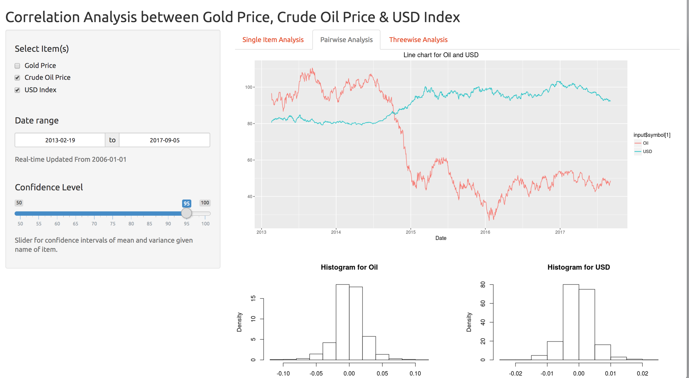

# IEOR4150-Project
## What is the relations between Gold, Oil, and the US Dollar? 
This is the final course project of IEOR4150 Probability and Statistics at Columbia University. The goal is to implement statistical analysis methods on real word data, and develop a product to show the result.
Link to the Shiny App: https://jessicaji.shinyapps.io/4150project_correlationanalysis/

### Project Description
Until the 1970s, the United States economy was based on the “Gold Standard” system, in which the value of the US dollar was based on the value of gold. But after the system was abandoned, what is the situation nowadays? Besides, we also see a lot of articles saying there is link between oil and gold prices. Is it the real situation? How strong is the relationship? 

This ShinyApp is connected to Financial platform [Quandl](https://www.quandl.com/) API, shows the trendency of US Dollar, gold and oil price, as well as pairwise, three-wise analysis on them, which includes *Hypothesis Testing, Linear Regression, Correlation Analysis*. User can change their preferences on subjects and *cnofidence interval*. 

### Screeshot of App

### Conclusion
* The log return of oil, gold, and US dollar cannot be predicted over time period. The results were consistent with the real market and people’s knowledge.
* At 95% confidence level, log return between oil and gold were positively related; the log return between gold and US dollar were negatively related; the relationship between the log return of oil and US dollar was negative. 
